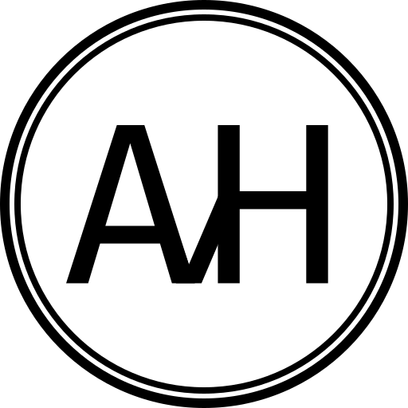

<p align="center">
  <a href="https://www.vanhelbergen.com">
    
  </a>
</p>
<h1 align="center">
  www.vanhelbergen.com<br />
  <small><code>vanhelbergen-com-v4</code></small>
</h1>

Personal / portfolio site (v4) – Next.js 15 + React 19 + TypeScript + Tailwind. Fast, accessible, content‑driven foundation.

## Tech Stack

- Next.js 15 (App Router) / React 19
- TypeScript (strict) / ESLint (flat) / Prettier
- Tailwind CSS / PostCSS / Autoprefixer
- Vitest + Testing Library (unit / component)
- Playwright (e2e) / axe-core (a11y checks)

## Getting Started

```bash
npm install
npm run dev
```

Visit http://localhost:3000.

## Scripts

```json
{
  "dev": "next dev",
  "build": "next build",
  "start": "next start",
  "lint": "eslint .",
  "typecheck": "tsc --noEmit",
  "format": "prettier --write .",
  "test": "vitest run",
  "test:watch": "vitest",
  "test:coverage": "vitest run --coverage",
  "e2e": "playwright test",
  "e2e:ui": "playwright test --ui",
  "verify": "npm run typecheck && npm run lint && npm test"
}
```

## Directory Structure

```
app/                # App Router entrypoints
	layout.tsx
	page.tsx
components/         # (future) UI primitives & layout
content/            # (future) MDX/markdown
lib/                # Framework-agnostic utilities
public/             # Static assets
styles/             # Global / Tailwind artifacts
tests/              # Unit & e2e tests
```

## Testing

Run unit tests:

```bash
npm test
```

Watch mode:

```bash
npm run test:watch
```

E2E tests (after `npm run build && npm start &` in another shell):

```bash
npm run e2e
```

## Linting & Formatting

```bash
npm run lint
npm run format
```

## Tailwind

Classes are ordered via plugin; keep design tokens minimal and deliberate.

## Accessibility

Every interactive element must have discernible text / label. Use semantic HTML first.

## Deployment

Build:

```bash
npm run build
```

Then serve with `npm start`.

---

Generated scaffold; see `copilot-instructions.md` for full contribution contract.
